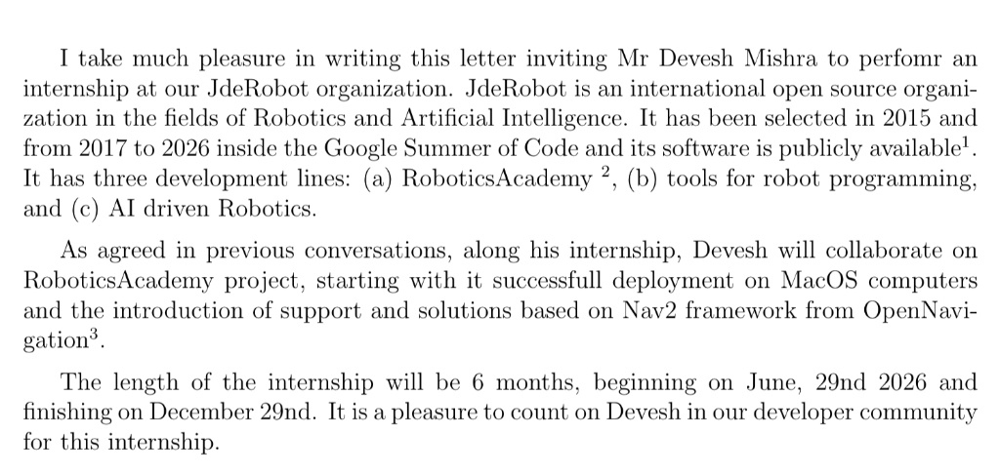

# JdeRobot Internship 2026 - Devesh Mishra

This repository tracks my developer internship at JdeRobot.

## Internship Details

* **Collaborator:** Devesh Mishra
* **Organization:** JdeRobot
* **Project:** RoboticsAcademy
* **Duration:** 6 months (June 29, 2026 - December 29, 2026)
* **Progress Blog:** [https://theroboticsclub.github.io/2026-internship-Devesh_Mishra/](https://theroboticsclub.github.io/2026-internship-Devesh_Mishra/)

### Project Scope

During the internship, the work involves collaborating on the RoboticsAcademy project, starting with its successful deployment on macOS computers and the introduction of support and solutions based on the Nav2 framework from OpenNavigation.

JdeRobot is an international open-source organization in the fields of Robotics and Artificial Intelligence. The organization has three development lines:
1. RoboticsAcademy
2. Tools for robot programming
3. AI driven Robotics

### Invitation Letter

