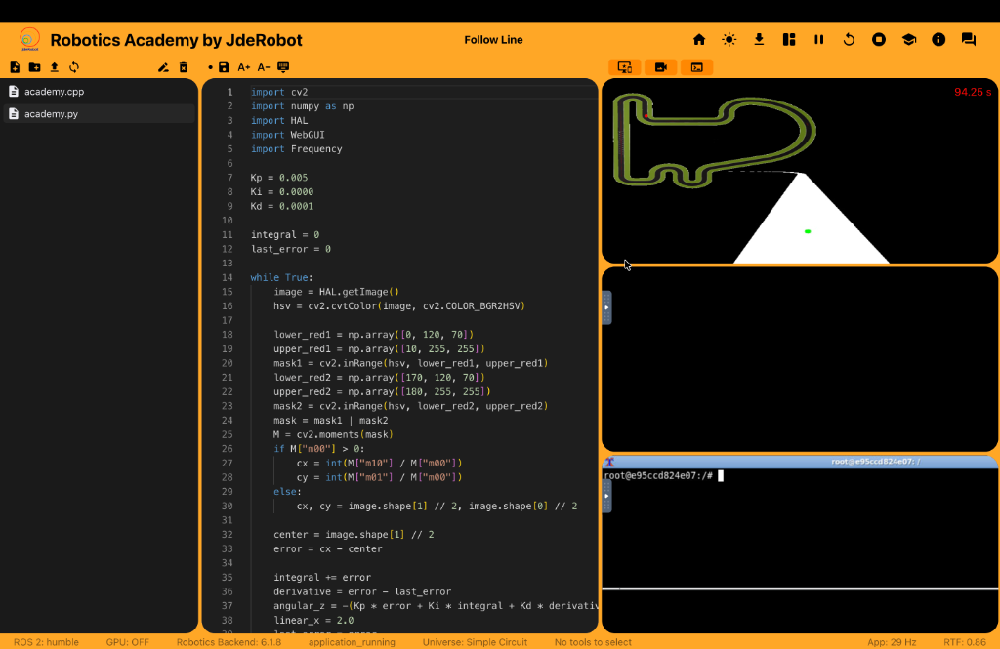

# JdeRobot Internship 2026 - Devesh Mishra

This repository tracks my progress, documentation, and weekly development updates during my 6-month developer internship at JdeRobot.

## Internship Overview

JdeRobot is an international open-source organization in the fields of robotics and artificial intelligence. During this internship, I am collaborating on the RoboticsAcademy project.

* **Duration:** 6 months (June 29, 2026 - December 29, 2026)
* **Mentors:** JdeRobot Development Team
* **Primary Objectives:**
  * Successful deployment of RoboticsAcademy on macOS computers.
  * Implementation of support and development of solutions based on the Nav2 framework from OpenNavigation.

### Internship Invitation

---

## Weekly Progress Blog

I maintain a weekly progress log documenting my work. The blog is hosted on GitHub Pages.

* **Blog Link:** [https://theroboticsclub.github.io/2026-internship-Devesh_Mishra/](https://theroboticsclub.github.io/2026-internship-Devesh_Mishra/)

---

## Week 1 Progress Summary (July 2 - July 8)

My first week focused on environment configuration, display forwarding diagnostics, and codebase synchronization.

### 1. Storage Optimization
* Cleared redundant caches to resolve a storage limit that affected Docker.
* Restored active host storage capacity.

### 2. Display Forwarding Diagnostics
* Configured and tested XQuartz on macOS to handle graphical forwarding from the container to the host desktop.

### 3. Repository Alignment and React Compilation
* Synchronized the local codebase with upstream releases on GitHub to resolve api inconsistencies.
* Fixed package bundling conflicts and recompiled the frontend assets to successfully load the Follow Line exercise layout.

### Loaded Follow Line Exercise Layout

---

## Repository Structure

* `docs/`: Holds the source files for the Jekyll Chirpy progress blog.
  * `docs/_posts/`: Contains markdown source files for weekly progress posts.
  * `docs/assets/`: Media files, screenshots, and visual assets used in reports.
* `.github/workflows/`: Automation pipelines for building and deploying the blog.