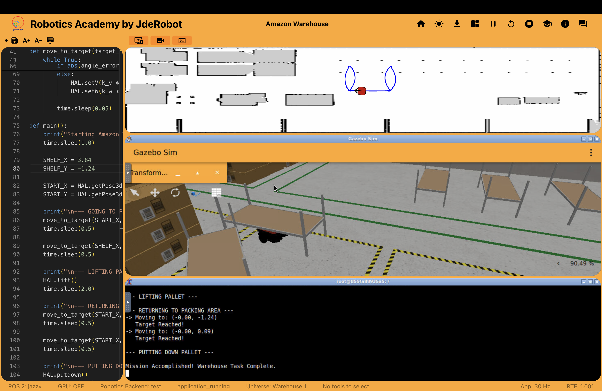
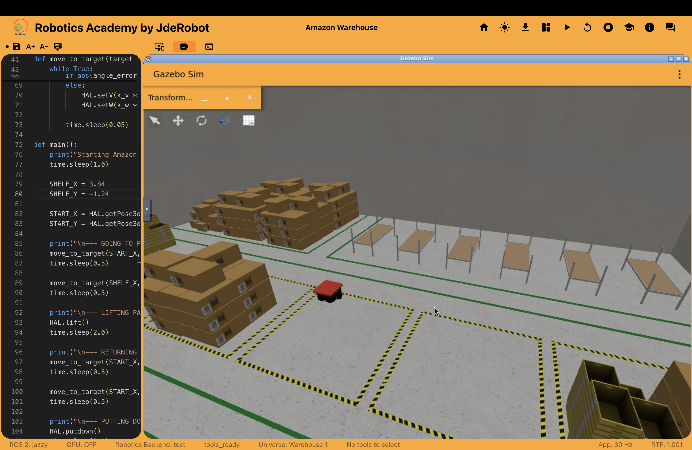

# Weekly Update - Week 12

## Porting and Testing ROS 2 Jazzy and Amazon Warehouse

This week, we continued working on the cross-platform capabilities of Robotics Academy on macOS Apple Silicon, testing the integration of modern ROS 2 tools and addressing compatibility bugs.

---

## 1. Validating ROS 2 Jazzy
We began the week by testing the migration to **ROS 2 Jazzy Jalisco**. Initial benchmarking and environment tests proved successful, confirming that the base configuration, ROS 2 workspace, and custom Docker container are functioning correctly on ARM64 architecture without Rosetta 2 overhead.

---

## 2. Implementing Amazon Warehouse (Autonomous Navigation)
Following the success of ROS 2 Jazzy, we focused on the **Amazon Warehouse** exercise, which involves an autonomous holonomic robot navigating a simulated grid to pick up and deliver pallets.

### The Nav2 Expectation vs. Classic Approach
Initially, there was an assumption that navigation should be handled entirely by the **Nav2 (Navigation2)** stack, using Action Clients to send goal poses (like RViz's 2D Goal Pose). However, the core learning objective of the Amazon Warehouse exercise in Robotics Academy is to teach students underlying robotics math (such as A* Path Planning and PID/Bug control). Therefore, the backend does not spawn the full Nav2 stack (map_server, amcl, bt_navigator). We adapted our approach to implement an autonomous, sensor-based navigation script instead.

### Fixing Backend Template Bugs
During testing, we discovered two critical bugs in the provided `HAL.py` and `WebGUI.py` templates for Gazebo Jetty:
1. **Robot Namespace Mismatch:** The templates were hardcoded to listen and publish to `/amazon_robot/odom` and `/amazon_robot/cmd_vel`. However, the robot spawned in the Gazebo Jetty world is actually named `logistic_robot`.
2. **Platform Lift Bug:** The pallet-lifting mechanism published commands to `/platform/cmd_vel`, but the correct simulation topic is `/logistic_robot/platform/cmd_vel`.

We applied dynamic monkey-patches in our control script to force the `MotorsNode` and `OdometryNode` to connect to `/logistic_robot`. This immediately fixed the robot's movement and correctly updated the red tracker dot on the WebGUI map.

### Manhattan Routing (Aisle Navigation)
To prevent the robot from crashing into shelves, we implemented **Manhattan Routing**. Instead of navigating via a diagonal straight line (which clips shelf corners), our script follows the open warehouse aisles (moving along the Y-axis first, then turning 90 degrees to enter the shelf on the X-axis). By extracting the exact coordinates of the pallets directly from Gazebo's `/world/default/dynamic_pose/info` state dump (e.g., Pallet 0 at `X=3.84, Y=0.54`), the robot successfully navigates, lifts the pallets, and returns to the packing area.

---

## Media & Results

### Demonstration Video
Check out the robot autonomously navigating the Amazon Warehouse and picking up pallets:

### Simulation Screenshots
*Navigating the Amazon Warehouse using ROS 2 Jazzy and Gazebo Jetty:*

