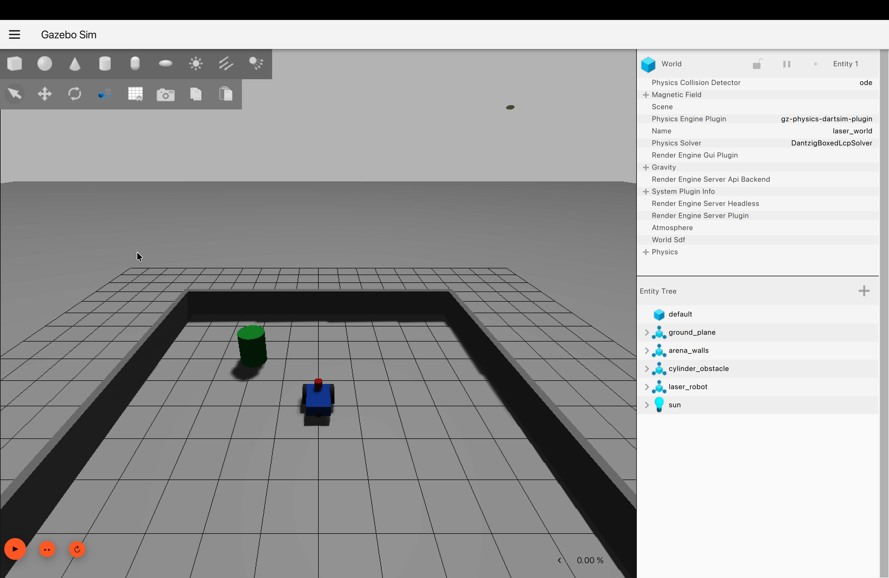
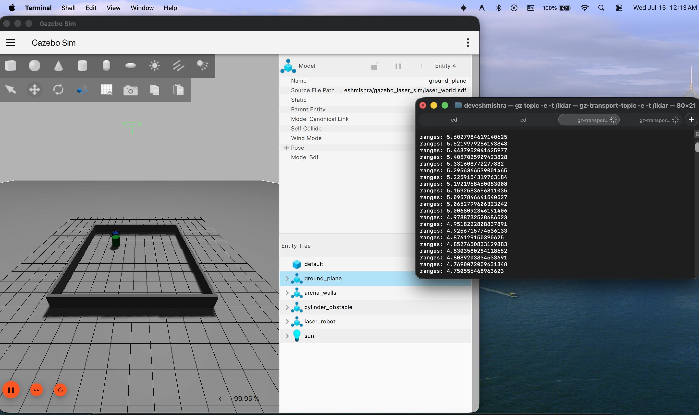
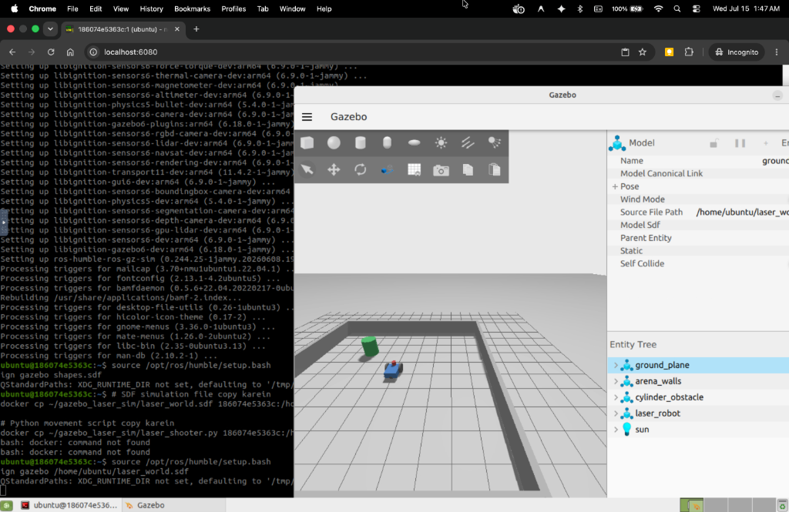

This week, my main task was to install, configure, and run the Gazebo simulator and set up a custom robot simulation with a working Lidar sensor. 

## Weekly Progress Summary
To find the best approach for our project, I experimented with three different ways to install and run Gazebo. 

### Method 1: Local Binary Package Installation (ROS 2 Humble)
The first and most straightforward method was installing Gazebo directly on the host system using the official binary packages via the `apt` package manager. 

**Working:**
After installation, I launched Gazebo and echoed the `/lidar` sensor topic in the terminal. As seen in the screenshot, real-time lidar range coordinates were successfully published over the ROS 2 network.

### Method 2: Local Source Build (colcon workspace)
The second method involved compiling Gazebo directly from its source code. 

**What is a Source Build?**
Normally, when we install software (like Method 1), we download pre-compiled "binaries" that are ready to run. A "source build", on the other hand, means downloading the actual raw code written by the developers and compiling it on our own computer. This allows us to make custom changes to the simulator's code or test the absolute latest features that aren't available in standard packages yet.

**Working:**
I created a dedicated `colcon` workspace, downloaded the source repositories, and compiled them. After building, I sourced the local setup files and successfully launched the Gazebo GUI from our custom build.

### Method 3: Ubuntu VNC Docker Container 
The third method utilized a Dockerized Ubuntu container pre-configured with ROS 2 Humble and a VNC server. This approach completely isolates the simulation environment and allows us to view the Gazebo graphical interface through a web browser.

**Working:**
Inside the container, I sourced the ROS 2 workspace, launched Gazebo, and spawned our custom robot. The visual interface was perfectly accessible via the browser.

---

## Developing the Lidar Simulation

One of the major tasks this week was adding a functioning Lidar sensor to our custom robot. 

### How it was built:
1. **Sensor Integration:** Added a `ray` sensor (Lidar) plugin inside the robot's `.sdf` (Simulation Description Format) file.
2. **Topic Bridging:** Used the `ros_gz_bridge` package to connect Gazebo's internal topics with standard ROS 2 topics so that our ROS 2 nodes could read the sensor data.
3. **Visualization:** Used Gazebo's GUI to visualize the laser rays hitting obstacles.

### Difficulties Faced & How I Dealt With Them:
1. **Data Not Showing Up:** Initially, the Lidar data wasn't publishing to the ROS 2 network. 
   - *Solution:* I discovered that Gazebo and ROS 2 were using mismatched Topic names. I configured the `ros_gz_bridge` to correctly map the Gazebo Lidar topic to the ROS 2 `/lidar` topic.
2. **QoS (Quality of Service) Mismatches:** ROS 2 would sometimes drop the sensor messages.
   - *Solution:* I adjusted the QoS reliability settings in the ROS 2 subscriber to match the Gazebo publisher, ensuring smooth data flow.
3. **Container Display Crashes:** Running the 3D visualization directly from a standard Docker container often crashed the display server.
   - *Solution:* Adopting the VNC container approach (Method 3) provided a stable, isolated display environment that completely resolved these crashes.
