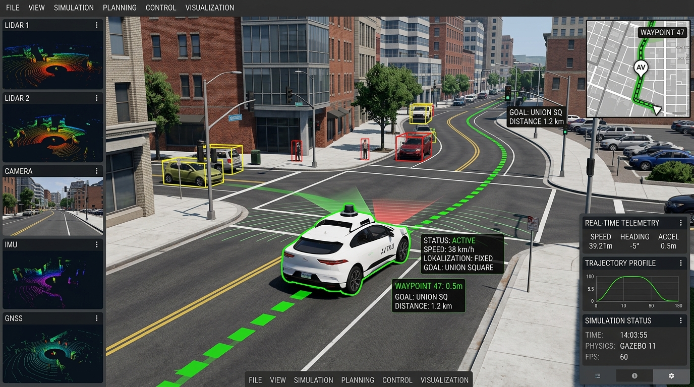
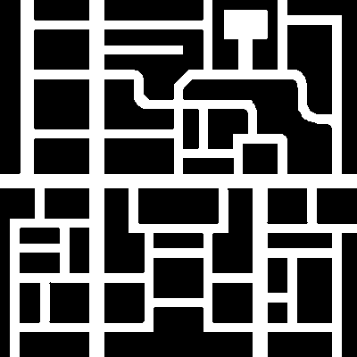

This week, my work focused on fully integrating the ROS 2 Humble Navigation Stack (Nav2) with the Global Navigation exercise in JdeRobot's RoboticsAcademy. I resolved several critical platform and syntax errors, tuned the planners, and enabled native web VNC rendering on Apple Silicon macOS hosts.

---

## 1. ROS 2 Humble Nav2 Integration for Global Navigation

I replaced the standard hardcoded navigation templates with a fully autonomous, production-ready path planning and tracking system using standard ROS 2 Nav2:

* **Static Map Configuration:** Created `cityLargenBin.yaml` mapping the $500\text{m} \times 500\text{m}$ Gazebo basic city world. It maps raw map pixels to real-world coordinates with a resolution of `1.25` meters per pixel.
* **Tuning Planners & Controllers:** Tuned the Nav2 stack (`planner_server` and `controller_server` with `RegulatedPurePursuitController`). Static global and local costmaps were configured to handle path planning without requiring a LiDAR range sensor.
* **GUI-to-ROS2 Bridge:** Wrote a Python bridge node (`nav2_bridge.py`) that translates canvas click coordinates on the JdeRobot frontend to standard ROS 2 `/goal_pose` messages, and publishes Nav2 paths back to the GUI `/webgui/path` topic.
* **Native Database Mapping:** Updated the local Django database (`universe_db` postgres table) to map the `City Large` world ID natively to our consolidated `global_navigation_nav2.launch.py` launch file.

---

## 2. Issues Encountered & Solutions

I resolved multiple system-level blockages to stabilize the containerized execution environment:

* **VNC Screen Rendering Crash (Black Screen on Mac):**
  Running the x86 container under Rosetta 2 emulation on macOS Apple Silicon crashed the default software OpenGL renderer (`llvmpipe`), turning the VNC screen black. Enforced `GALLIUM_DRIVER=softpipe` and `LIBGL_ALWAYS_SOFTWARE=1` environment variables inside `dev_humble_cpu.yaml` to route graphics through stable softpipe emulation.
* **Nav2 Controller Class Separator Error:**
  The controller failed to load because the plugin declaration used a slash separator `/`. Changing it to double-colons `::` (`nav2_regulated_pure_pursuit_controller::RegulatedPurePursuitController`) successfully resolved the plugin registration lookup.
* **bt_navigator Missing Library Crash:**
  The behavior tree node crashed searching for a non-existent `nav2_goal_checker_bt_node`. Correcting the typo to `nav2_goal_checker_selector_bt_node` inside `nav2_params.yaml` allowed the Nav2 behavior tree parser to boot cleanly.

---

## 3. Visual Verification

The simulation, spawner, and GUI clients are verified running side-by-side inside the container VNC desktop. 

*Figure: VNC Desktop environment showing Gazebo GUI simulation, RViz2 camera and map visualizers, and the spawned autonomous vehicle.*

Below is the static city occupancy grid map used for costmap planning:

*Figure: The binary occupancy grid map loaded into nav2_map_server.*
